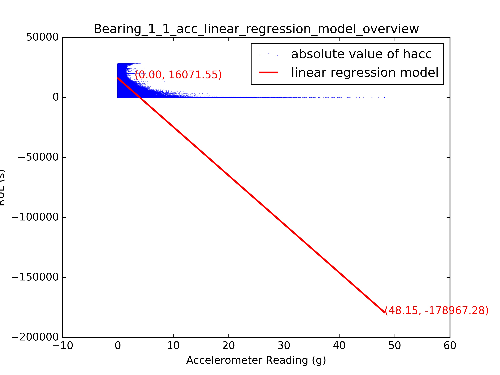
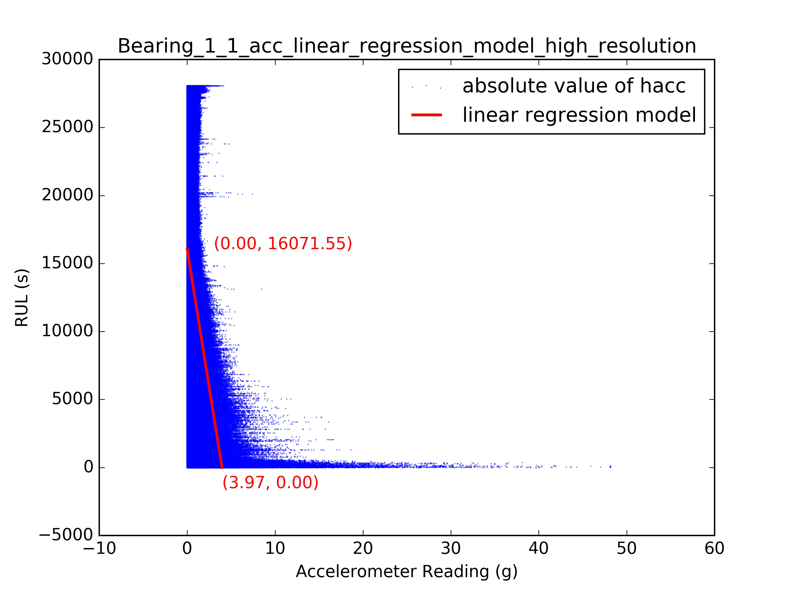

# Model Observation

### Linear Regression

```
/phm2012/src/plot $ python model-observation.py
```

We use the absolute value of hacc of bearing_1_1 dataset to train a linear regression model, and highlight it with red color:



Then we zoom in the picture to fit a proper scale:


