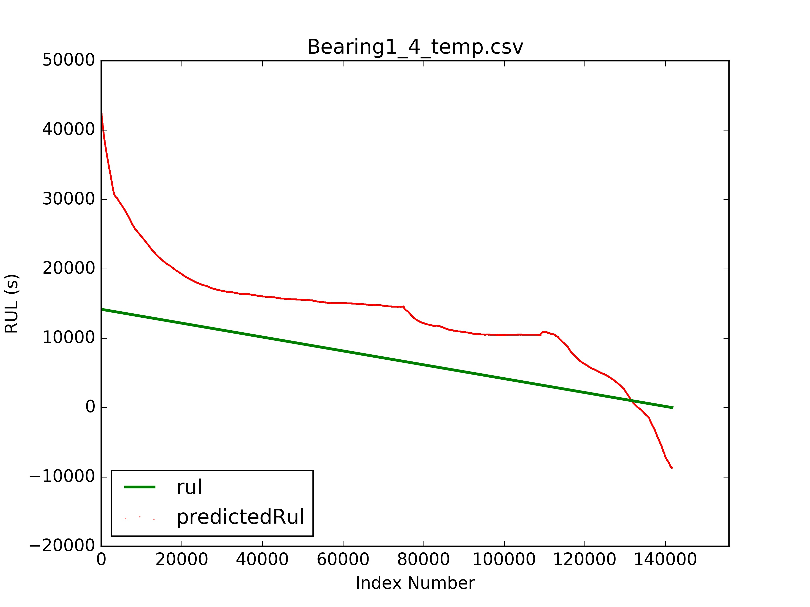
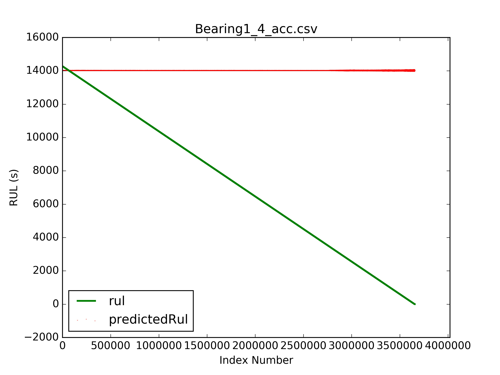
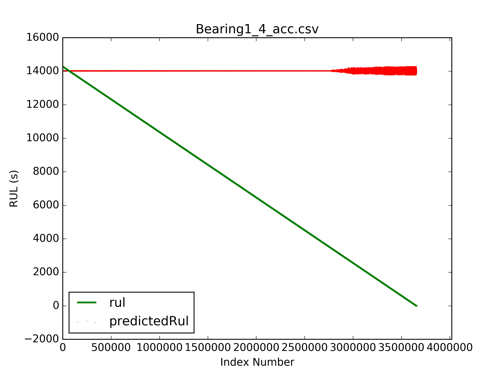
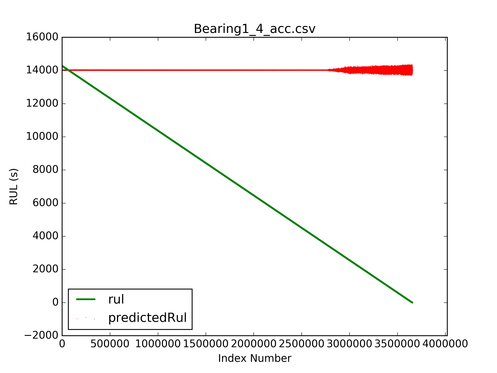
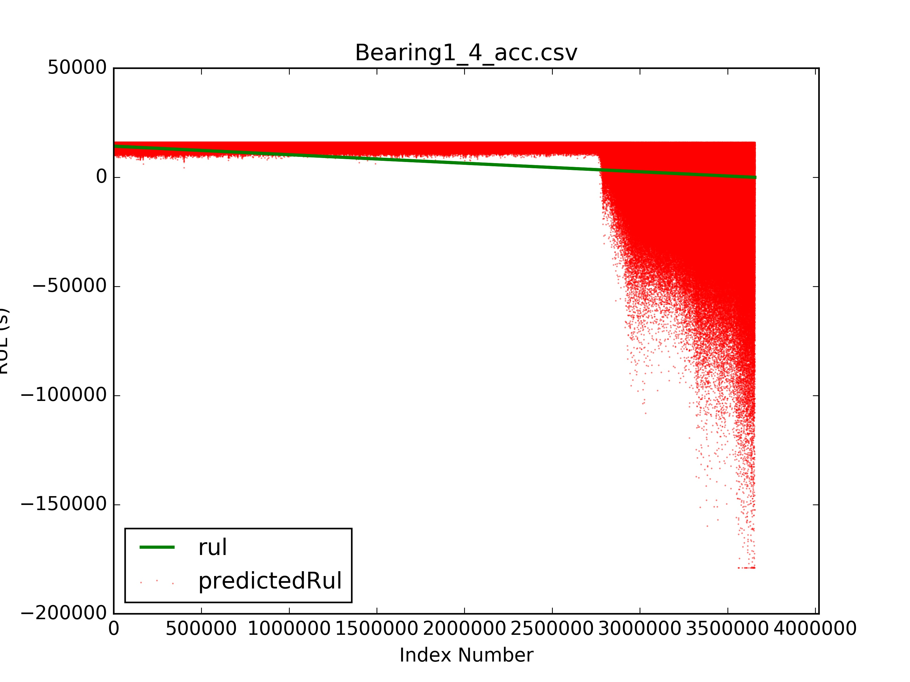

# Model Prediction

## Procedure

### Method 1

Using only `bearing_1_1` to build model:

```
/phm2012/src/predict $ python method_1_bearing_1_1.py
```

We use each of the following list of training features to build 7 models:

1. (temparature)
2. (hacc)
3. (vacc)
4. (hacc, vacc)
5. (abs(hacc))
6. (abs(vacc))
7. (abs(hacc), abs(vacc))

## Result

```
/phm2012/src/plot $ python model-prediction.py
```

Here are output plots of `Bearing1_4`, 1 plot for each model:













