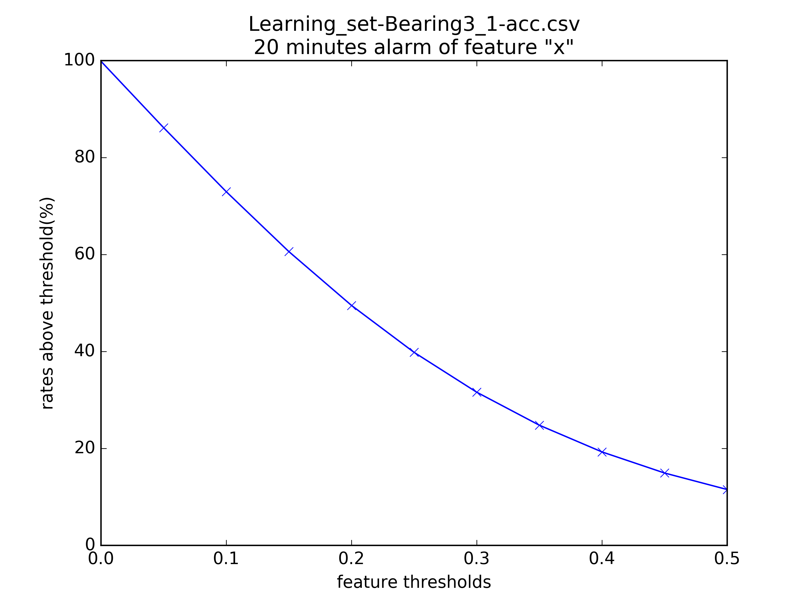
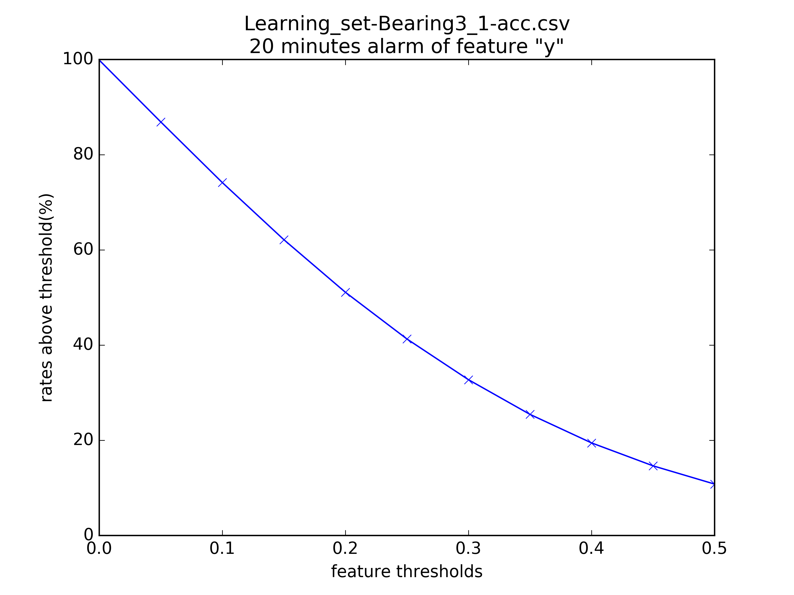
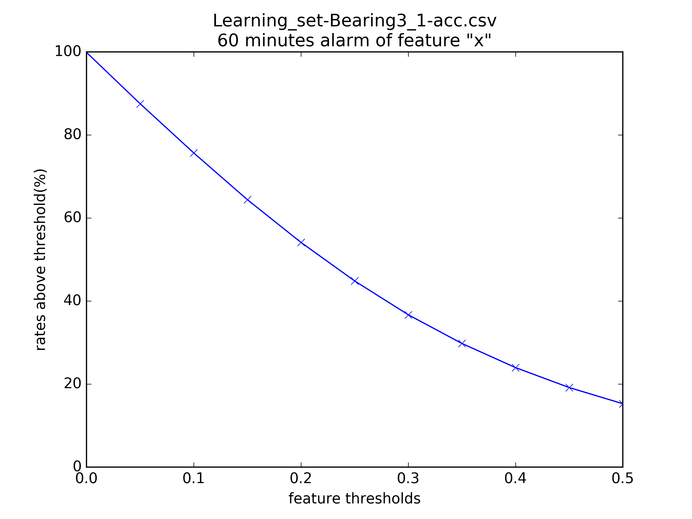
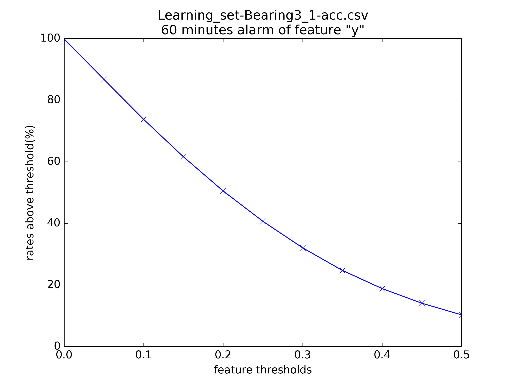

# 建立可靠度指標

繪製指標趨勢圖

``` bash
/src $ python threshold.py \
    --src ../build/data/phm2012/labeled/Learning_set-Bearing3_1-acc.csv \
    --dest-dir ../build/plots/phm2012/threshold \
    --alarm-minutes 20 \
    --columns x y \
    --abs \
    --thresholds 0.0 0.55 0.05
```

以上方執行參數為例，可得以下兩圖:





以第一張圖為例，其意義為「假如想在機器壞掉前20分鐘預知，則可透過觀察x振動值，得到門檻值與錯誤機率的關係圖」，例如當`x振動值`的門檻值設為`0.5`時，提前20分鐘預警的錯誤率約為`10%`。

若反過來設定目標容錯機率`10%`，則部署機器時可依據此圖推算x振動值門檻應設為`0.5`。

# 提前60分鐘預警

另外執行了60分鐘前預警的版本，其餘參數不變





# 完整數據

完整的log如下:

```
$ python threshold.py \
>     --src ../build/data/phm2012/labeled/Learning_set-Bearing3_1-acc.csv \
>     --dest-dir ../build/plots/phm2012/threshold \
>     --alarm-minutes 20 \
>     --columns x y \
>     --abs \
>     --thresholds 0.0 2 0.05

=====================
Feature "x":
threshold 0.000000 = 99.857271% (999770 / 1001199)
threshold 0.050000 = 86.162791% (862661 / 1001199)
threshold 0.100000 = 72.960121% (730476 / 1001199)
threshold 0.150000 = 60.605035% (606777 / 1001199)
threshold 0.200000 = 49.505143% (495645 / 1001199)
threshold 0.250000 = 39.818857% (398666 / 1001199)
threshold 0.300000 = 31.601809% (316397 / 1001199)
threshold 0.350000 = 24.792973% (248227 / 1001199)
threshold 0.400000 = 19.283479% (193066 / 1001199)
threshold 0.450000 = 14.929999% (149479 / 1001199)
threshold 0.500000 = 11.522584% (115364 / 1001199)
threshold 0.550000 = 8.924000% (89347 / 1001199)
threshold 0.600000 = 6.924098% (69324 / 1001199)
threshold 0.650000 = 5.390237% (53967 / 1001199)
threshold 0.700000 = 4.212649% (42177 / 1001199)
threshold 0.750000 = 3.310231% (33142 / 1001199)
threshold 0.800000 = 2.624953% (26281 / 1001199)
threshold 0.850000 = 2.100981% (21035 / 1001199)
threshold 0.900000 = 1.681084% (16831 / 1001199)
threshold 0.950000 = 1.351080% (13527 / 1001199)
threshold 1.000000 = 1.094288% (10956 / 1001199)
threshold 1.050000 = 0.888535% (8896 / 1001199)
threshold 1.100000 = 0.720936% (7218 / 1001199)
threshold 1.150000 = 0.589693% (5904 / 1001199)
threshold 1.200000 = 0.483920% (4845 / 1001199)
threshold 1.250000 = 0.394827% (3953 / 1001199)
threshold 1.300000 = 0.325510% (3259 / 1001199)
threshold 1.350000 = 0.268079% (2684 / 1001199)
threshold 1.400000 = 0.220635% (2209 / 1001199)
threshold 1.450000 = 0.181283% (1815 / 1001199)
threshold 1.500000 = 0.148722% (1489 / 1001199)
threshold 1.550000 = 0.118758% (1189 / 1001199)
threshold 1.600000 = 0.096784% (969 / 1001199)
threshold 1.650000 = 0.078905% (790 / 1001199)
threshold 1.700000 = 0.066420% (665 / 1001199)
threshold 1.750000 = 0.055334% (554 / 1001199)
threshold 1.800000 = 0.043947% (440 / 1001199)
threshold 1.850000 = 0.035757% (358 / 1001199)
threshold 1.900000 = 0.028366% (284 / 1001199)
threshold 1.950000 = 0.022873% (229 / 1001199)

=====================
Feature "y":
threshold 0.000000 = 99.870256% (999900 / 1001199)
threshold 0.050000 = 86.882927% (869871 / 1001199)
threshold 0.100000 = 74.143602% (742325 / 1001199)
threshold 0.150000 = 62.149683% (622242 / 1001199)
threshold 0.200000 = 51.101130% (511624 / 1001199)
threshold 0.250000 = 41.287396% (413369 / 1001199)
threshold 0.300000 = 32.733453% (327727 / 1001199)
threshold 0.350000 = 25.446090% (254766 / 1001199)
threshold 0.400000 = 19.452576% (194759 / 1001199)
threshold 0.450000 = 14.635552% (146531 / 1001199)
threshold 0.500000 = 10.801849% (108148 / 1001199)
threshold 0.550000 = 7.872461% (78819 / 1001199)
threshold 0.600000 = 5.659414% (56662 / 1001199)
threshold 0.650000 = 4.021478% (40263 / 1001199)
threshold 0.700000 = 2.818221% (28216 / 1001199)
threshold 0.750000 = 1.957353% (19597 / 1001199)
threshold 0.800000 = 1.365163% (13668 / 1001199)
threshold 0.850000 = 0.948363% (9495 / 1001199)
threshold 0.900000 = 0.657612% (6584 / 1001199)
threshold 0.950000 = 0.458650% (4592 / 1001199)
threshold 1.000000 = 0.320116% (3205 / 1001199)
threshold 1.050000 = 0.223532% (2238 / 1001199)
threshold 1.100000 = 0.158610% (1588 / 1001199)
threshold 1.150000 = 0.111466% (1116 / 1001199)
threshold 1.200000 = 0.079804% (799 / 1001199)
threshold 1.250000 = 0.060028% (601 / 1001199)
threshold 1.300000 = 0.045146% (452 / 1001199)
threshold 1.350000 = 0.033760% (338 / 1001199)
threshold 1.400000 = 0.026468% (265 / 1001199)
threshold 1.450000 = 0.020276% (203 / 1001199)
threshold 1.500000 = 0.015082% (151 / 1001199)
threshold 1.550000 = 0.011786% (118 / 1001199)
threshold 1.600000 = 0.009589% (96 / 1001199)
threshold 1.650000 = 0.007691% (77 / 1001199)
threshold 1.700000 = 0.006292% (63 / 1001199)
threshold 1.750000 = 0.005793% (58 / 1001199)
threshold 1.800000 = 0.004694% (47 / 1001199)
threshold 1.850000 = 0.003995% (40 / 1001199)
threshold 1.900000 = 0.003795% (38 / 1001199)
threshold 1.950000 = 0.003396% (34 / 1001199)
```
